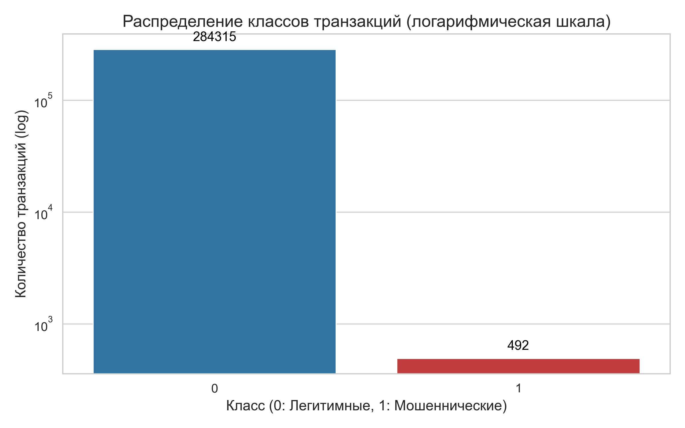
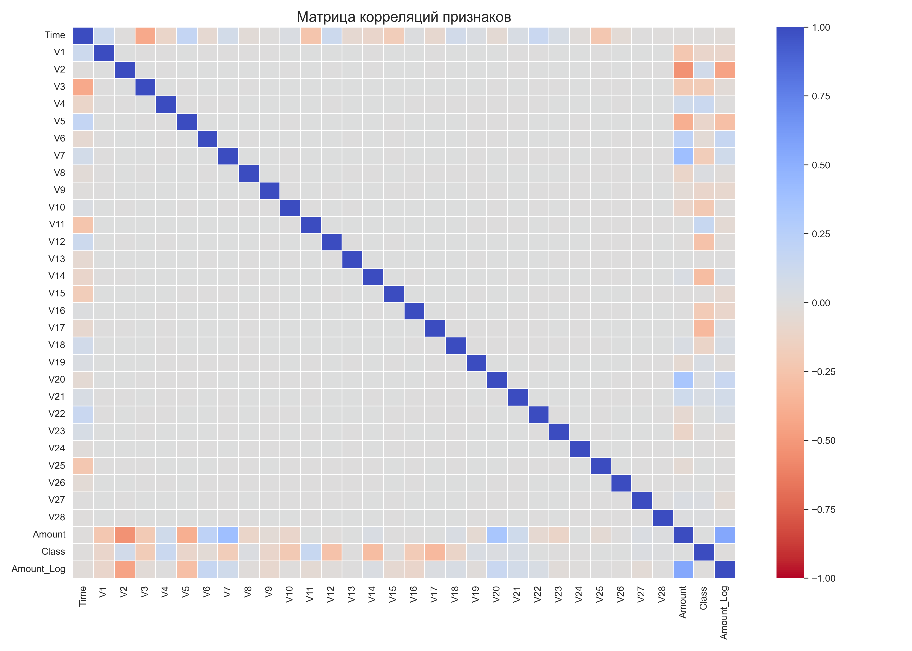
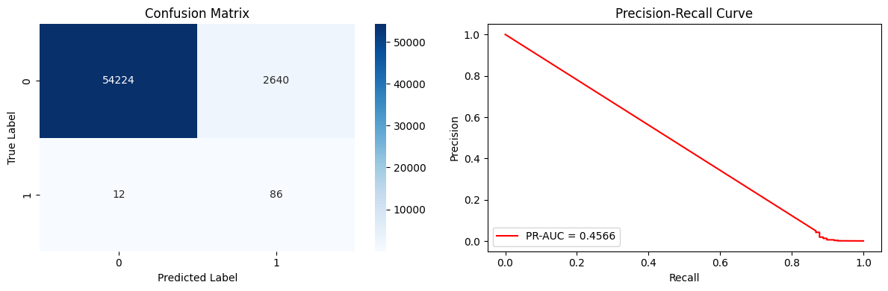
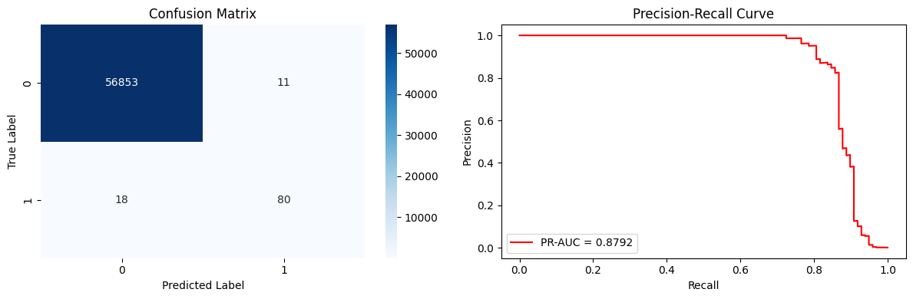
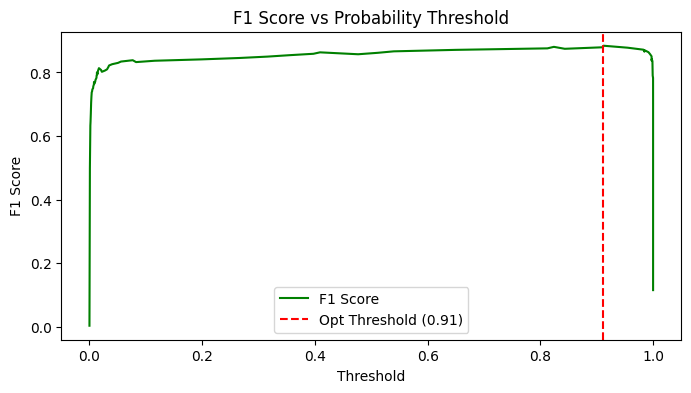
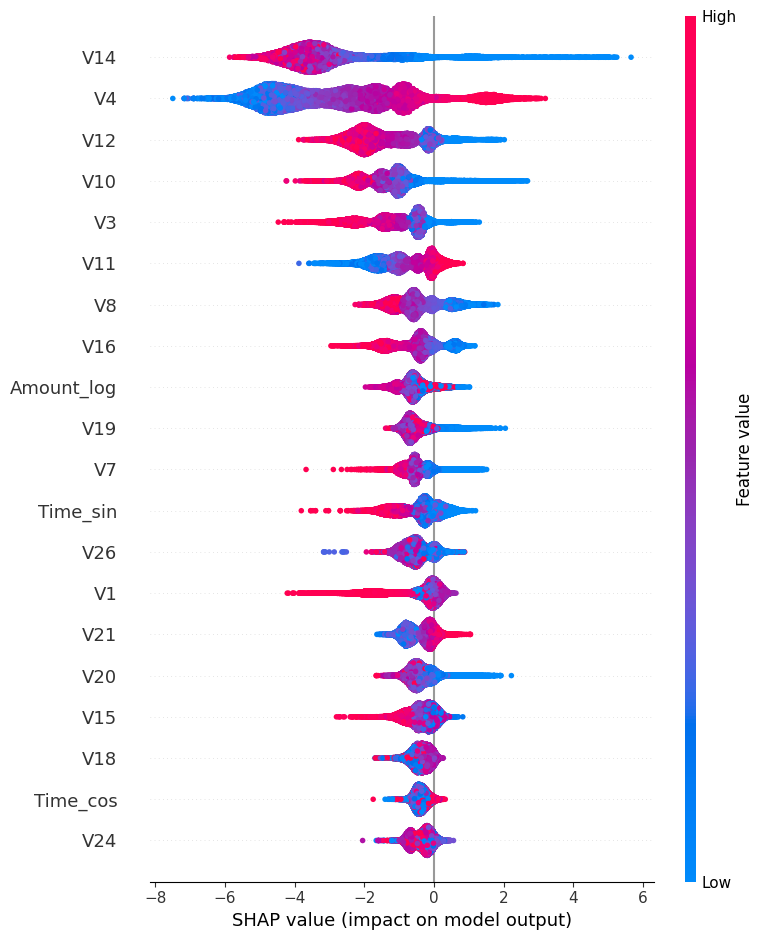

# Credit Card Fraud Detection: Balancing ML Metrics with Business ROI

[](https://www.python.org/)
[](https://xgboost.ai/)
[](https://streamlit.io/)
[](https://www.docker.com/)

**Live Web Dashboard:** https://diploma-krasnikov.streamlit.app/

## Project Overview
This repository contains the source code, interactive web dashboard, and research for detecting fraudulent financial transactions using Machine Learning.

The main challenge of this project is the extreme class imbalance, where frauds account for only 0.172% of all transactions. Rather than chasing abstract mathematical metrics like Accuracy or ROC-AUC (which are highly misleading in this context), this project focuses on optimizing actual business metrics. 

The ultimate goal is to minimize financial losses from fraud while drastically reducing False Positives (unnecessary card blocks) to preserve customer loyalty and save operational costs for the bank.

## Key Findings & Visual Analysis

### 1. Exploratory Data Analysis & Feature Engineering
Raw transaction data (Time and Amount) was heavily skewed. We applied trigonometric cyclic encoding for time and logarithmic transformation for transaction amounts to improve the models' ability to detect cyclical nighttime attack patterns and micro-transactions.


*Extreme class imbalance: 99.8% legitimate vs 0.17% fraud transactions.*


*Correlation matrix highlighting top negative predictors (e.g., V14, V12).*

### 2. Solving Extreme Imbalance (SMOTE vs Class Weights)
We compared data-level approaches (SMOTE) with algorithmic penalty weights across Logistic Regression, XGBoost, LightGBM, and CatBoost.

**The LightGBM Collapse:**
An interesting algorithmic behavior was discovered. Under extreme class weights, LightGBM's leaf-wise growth strategy suffered from "probability calibration collapse", assigning almost all transactions to the positive class and degrading the PR-AUC to 0.4566.


**The Winner (XGBoost + Class Weights):**
XGBoost with algorithmic class weights proved to be the most robust and computationally efficient model (1.5 seconds training time), achieving the highest PR-AUC without generating synthetic data.


### 3. Threshold Optimization & Business ROI
Default decision thresholds (p=0.5) yielded too many False Positives (~1,468 false alarms for base models). By performing dynamic threshold optimization maximizing the F1-score, we found an algorithmic optimum (p=0.912). 

However, in a real business scenario, a False Negative (missed fraud) costs significantly more than a False Positive (call center investigation). The interactive dashboard simulates this flow and calculates the actual **Business Optimum**, achieving an economic ROI of over 28,000%.


*F1-score optimization curve.*

### 4. Model Explainability (SHAP)
To ensure the model acts as a transparent tool rather than a "black box" for security analysts, SHAP (SHapley Additive exPlanations) was integrated. Anomalously low values of the V14 feature were identified as the strongest fraud trigger.


*SHAP summary plot illustrating the impact of each feature on the model's output.*

## Repository Structure

```text
├── README.md               <- Project overview
├── Dockerfile              <- Docker image configuration
├── pyproject.toml          <- uv project configuration
├── uv.lock                 <- Lockfile for exact dependency versions
├── xgb_model.json          <- Pre-trained XGBoost model weights
├── demo_data/              <- Subset of test data for the Web App
├── docs/                   <- Full thesis document (PDF)
├── notebooks/
│   ├── 01_EDA_and_Feature_Engineering.ipynb
│   └── 02_Model_Training_and_Evaluation.ipynb
└── src/
    └── app.py              <- Interactive Streamlit Dashboard source code
```

## How to Run (Local & Docker)

### Option 1: Using Docker (Recommended)
You can run the full interactive anti-fraud dashboard locally without installing Python dependencies using Docker.

1. Clone the repository:
   ```bash
   git clone https://github.com/CuteZerg/diploma.git
   cd diploma
   ```

2. Build and run the Docker container:
   ```bash
   docker build -t fraud-detection-app .
   docker run -p 8501:8501 fraud-detection-app
   ```

3. Open your browser and navigate to `http://localhost:8501`.

### Option 2: Using uv (Python Package Manager)
This project uses `uv` for lightning-fast dependency management.

1. Install uv:
   ```bash
   curl -LsSf https://astral.sh/uv/install.sh | sh
   # Or on Windows: powershell -ExecutionPolicy ByPass -c "irm https://astral.sh/uv/install.ps1 | iex"
   ```

2. Sync the environment and launch the app:
   ```bash
   uv sync
   uv run streamlit run src/app.py
   ```

## Author
Alexey Krasnikov
* [GitHub](https://github.com/CuteZerg)
* [Telegram](https://t.me/xCuteZerGx)